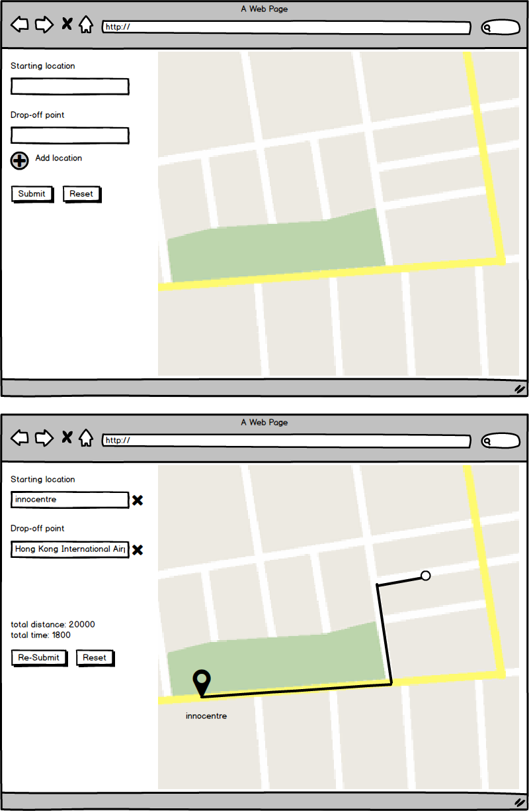

# Lalamove Software Engineer Challenge - Frontend

### Requirements
- Get start location and drop-off location from user. Submit them to [API](backend.md)
- Draw **driving route** returned by API on embedded [Google Map API](https://developers.google.com/maps/)
- API usage should be correct (according to the spec defined for [backend challenge](backend.md))

### Others requirements
- Source code must be stored in a git repository (you can send us github or bitbucket link)
  - For public repos:
	  - Avoid words `lalamove` and `challenge`
	  - Do not copy-paste any part of this file (task, API documentation, etc.)
	  - This is needed to prevent other candidates from finding your solution
- It should deploy as a public site using GitHub Pages/s3 etc.

### Expection
- We know you may have your life, this challange should able finished within 4 hours, and we expecting the solution should finished within a week
- Your solution should to be production ready that complete solutions aren't required, but what you do submit should needs to run.

#### Recommand Tech Stack
- We switching projects from jQuery to React, but feel free to use other tech if you prefer

### Wireframe
*For reference only, you can be creative with design and UI/UX features.*

**Questions? We love to answer: <techchallenge@lalamove.com>**
